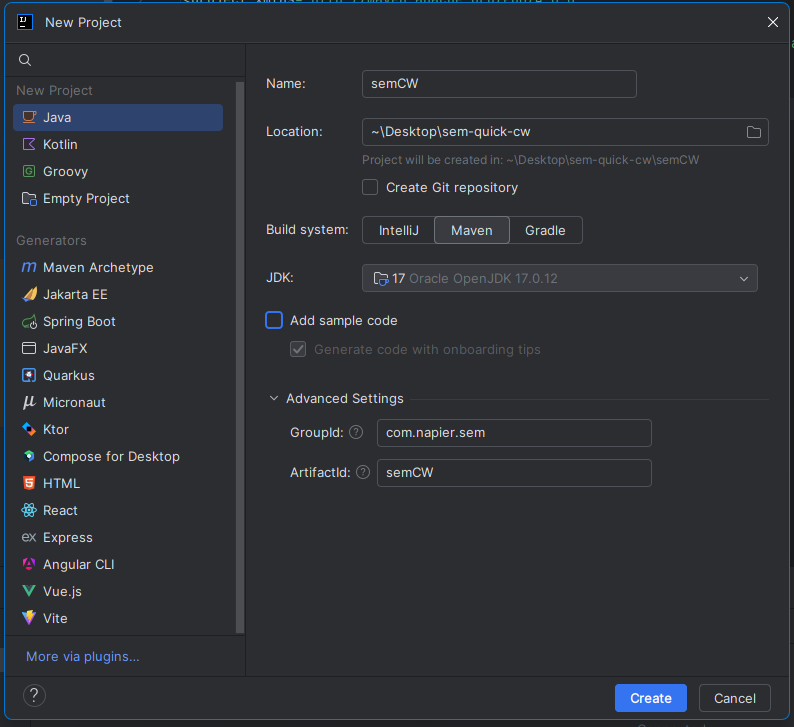
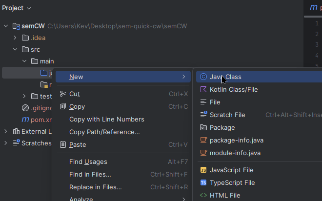
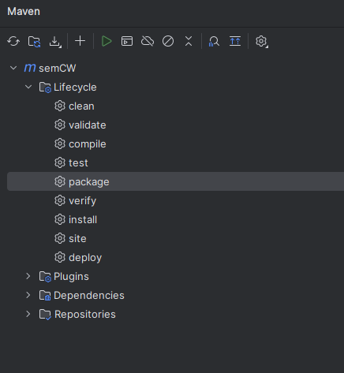
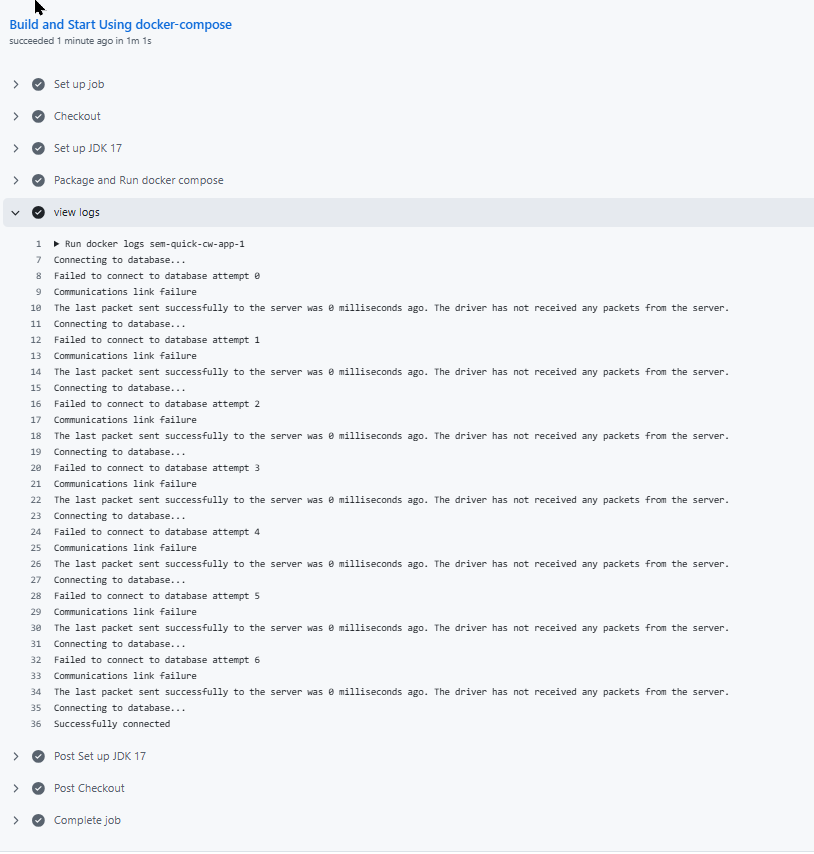

# sem-quick-cw

Create a new repository on GitHub


I added a LICENCE(Apache) .gitignore using Maven template and README.md

Clone to your machine (I cloned to Desktop)


Create a new Maven project named the same as the project (in the folder you cloned to (for me Desktop) using Java 17





The .gitignore only needs the following

```
target/
.mvn/
.idea/
```

Add a dependency to the Maven Config (pom.xml) for the MySQL connector. Your pom.xml should now look like

```xml
<?xml version="1.0" encoding="UTF-8"?>
<project xmlns="http://maven.apache.org/POM/4.0.0"
         xmlns:xsi="http://www.w3.org/2001/XMLSchema-instance"
         xsi:schemaLocation="http://maven.apache.org/POM/4.0.0 http://maven.apache.org/xsd/maven-4.0.0.xsd">
    <modelVersion>4.0.0</modelVersion>

    <groupId>com.napier.sem</groupId>
    <artifactId>semCW</artifactId>
    <version>1.0-SNAPSHOT</version>

    <properties>
        <maven.compiler.source>17</maven.compiler.source>
        <maven.compiler.target>17</maven.compiler.target>
        <project.build.sourceEncoding>UTF-8</project.build.sourceEncoding>
    </properties>

    <dependencies>
        <dependency>
            <groupId>mysql</groupId>
            <artifactId>mysql-connector-java</artifactId>
            <version>8.0.33</version>
        </dependency>
    </dependencies>
</project>
```

Add the Maven Build Config to build the App to a Jar with dependencies

The complete pom.xml is now

```xml
<?xml version="1.0" encoding="UTF-8"?>
<project xmlns="http://maven.apache.org/POM/4.0.0"
         xmlns:xsi="http://www.w3.org/2001/XMLSchema-instance"
         xsi:schemaLocation="http://maven.apache.org/POM/4.0.0 http://maven.apache.org/xsd/maven-4.0.0.xsd">
    <modelVersion>4.0.0</modelVersion>

    <groupId>com.napier.sem</groupId>
    <artifactId>semCW</artifactId>
    <version>1.0-SNAPSHOT</version>

    <properties>
        <maven.compiler.source>17</maven.compiler.source>
        <maven.compiler.target>17</maven.compiler.target>
        <project.build.sourceEncoding>UTF-8</project.build.sourceEncoding>
    </properties>

    <dependencies>
        <dependency>
            <groupId>mysql</groupId>
            <artifactId>mysql-connector-java</artifactId>
            <version>8.0.33</version>
        </dependency>
    </dependencies>
    
    <build>
        <plugins>
            <plugin>
                <artifactId>maven-jar-plugin</artifactId>
                <version>3.4.2</version>
                <executions>
                    <execution>
                        <id>default-jar</id>
                        <!--  skip building the default-jar -->
                        <phase>none</phase>
                    </execution>
                </executions>
            </plugin>
            <plugin>
                <groupId>org.apache.maven.plugins</groupId>
                <artifactId>maven-assembly-plugin</artifactId>
                <version>3.3.0</version>
                <configuration>
                    <finalName>semApp</finalName>
                    <archive>
                        <manifest>
                            <mainClass>com.napier.sem.App</mainClass>
                        </manifest>
                    </archive>
                    <descriptorRefs>
                        <descriptorRef>jar-with-dependencies</descriptorRef>
                    </descriptorRefs>
                    <appendAssemblyId>false</appendAssemblyId>
                </configuration>
                <executions>
                    <execution>
                        <id>make-assembly</id>
                        <phase>package</phase>
                        <goals>
                            <goal>single</goal>
                        </goals>
                    </execution>
                </executions>
            </plugin>
        </plugins>
    </build>
</project>
```


Add a Java package then a class to the src/main/java folder. I named the package com.napier.sem and the class App





Add the following code

```java
package com.napier.sem;

import java.sql.*;

public class App
{
	public static void main(String[] args)
	{
		try
		{
			// Load Database driver
			Class.forName("com.mysql.cj.jdbc.Driver");
		}
		catch (ClassNotFoundException e)
		{
			System.out.println("Could not load SQL driver");
			System.exit(-1);
		}

		// Connection to the database
		Connection con = null;
		int retries = 100;
		for (int i = 0; i < retries; ++i)
		{
			System.out.println("Connecting to database...");
			try
			{
				// Wait a bit for db to start
				Thread.sleep(1000);
				// Connect to database
				con = DriverManager.getConnection("jdbc:mysql://db:3306/world?useSSL=false&allowPublicKeyRetrieval=true", "root", "example");
				System.out.println("Successfully connected");
				// Wait a bit
				Thread.sleep(1000);
				// Exit for loop
				break;
			}
			catch (SQLException sqle)
			{
				System.out.println("Failed to connect to database attempt " + Integer.toString(i));
				System.out.println(sqle.getMessage());
			}
			catch (InterruptedException ie)
			{
				System.out.println("Thread interrupted? Should not happen.");
			}
		}

		if (con != null)
		{
			try
			{
				// Close connection
				con.close();
			}
			catch (Exception e)
			{
				System.out.println("Error closing connection to database");
			}
		}
	}
}
```


## Set Up World Database

Download the sample world database from [here](https://downloads.mysql.com/docs/world-db.zip). (Also in this repository)

Extract the world.sql file it to a folder called db in the root of our project

 Your project should look like the following (without the img folder)


Create a Dockerfile in the same directory

```dockerfile
FROM mysql/mysql-server:latest
COPY world.sql /docker-entrypoint-initdb.d
ENV MYSQL_ROOT_PASSWORD example
#Mac Fix
ENV MYSQL_ROOT_HOST=%
```


Add a Dockerfile in the root of the project for our Java App

```dockerfile
FROM openjdk:latest
COPY ./target/semApp.jar /tmp
WORKDIR /tmp
ENTRYPOINT ["java", "-jar", "semApp.jar"]
```

We will run both Dockerfiles with docker-compose

Add a file named `docker-compose` to the root of the project

```dockerfile
version: '3'
services:

  # Build app from Dockerfile in same folder
  app:
    build: .

  # Build the db as name db from the Dockerfile in the db folder
  # exposing the port if we want to run code outside a container
  db:
    build: db/.
    ports:
      - "33060:3306"

```

Package your project with Maven



Run docker-compose


Add

Commit

Push

## Add github actions

We can now set-up GitHub Actions. On your GitHub repository select the actions tab at the top then select *set up workflow yourself*


This will create a file in your repository named 

`.github/workflows/main.yml`

Replace the default text with the following

```xml
name: A workflow for my App
on: push

jobs:
  Build:
    name: Build and Start Using docker-compose
    runs-on: ubuntu-22.04
    steps:
      - name: Checkout
        uses: actions/checkout@v4
      - name: Set up JDK 17
        uses: actions/setup-java@v4
        with:
          java-version: '17'
          distribution: 'adopt'   
      - name: Package and Run docker compose
        run: |
          mvn package -DskipTests
          docker compose up --abort-on-container-exit
      - name: view logs
        run: docker logs sem-quick-cw-app-1

```

do a git pull

Make some changes then commit and push



If successful the view logs section should show Successfully connected at the bottom (once the database container builds)


We deserve a badge


```

```

